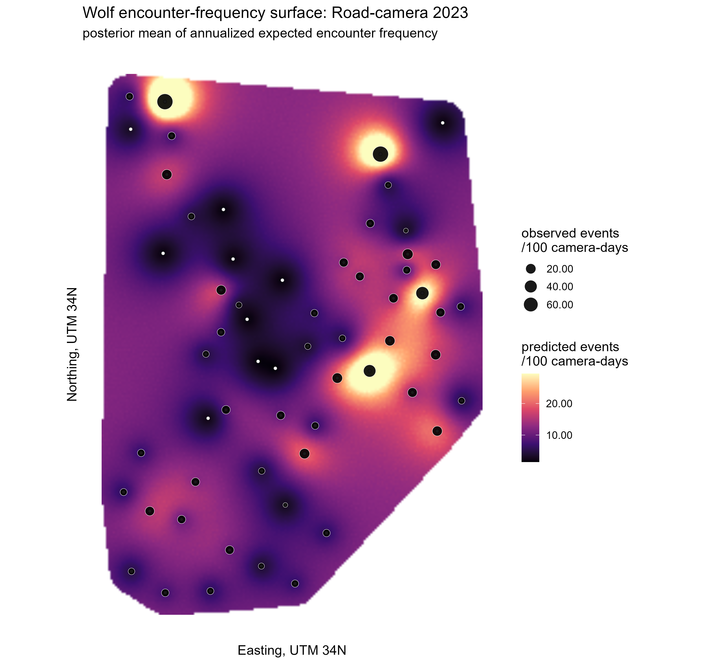
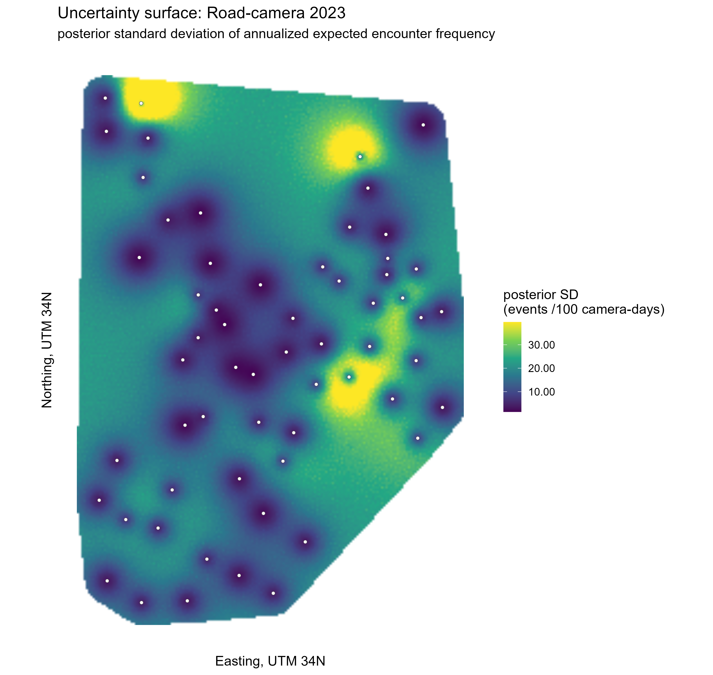
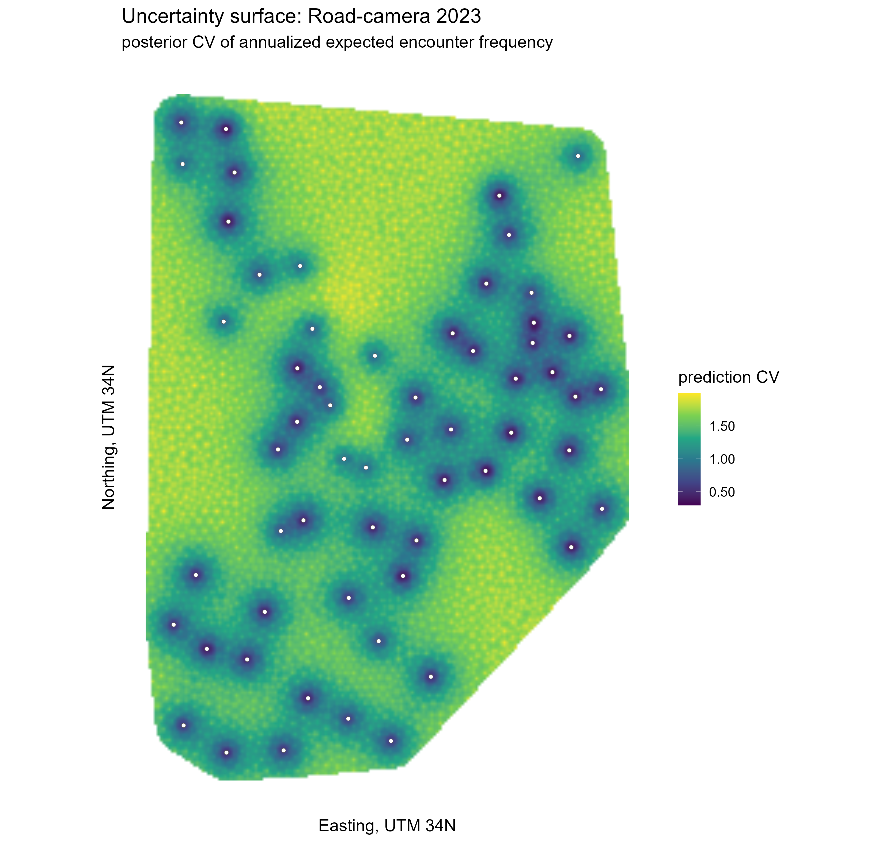
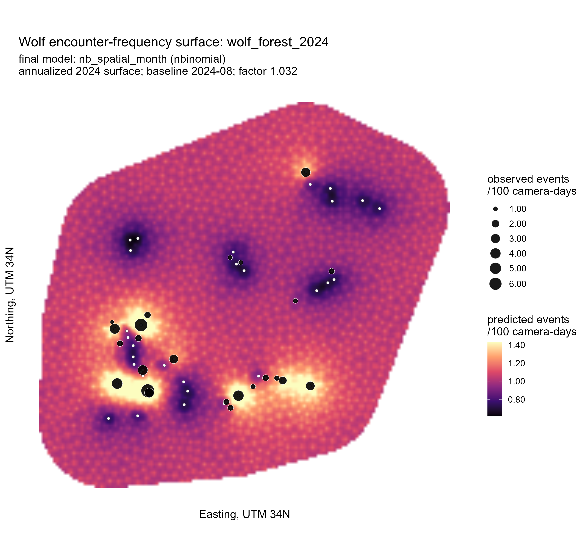
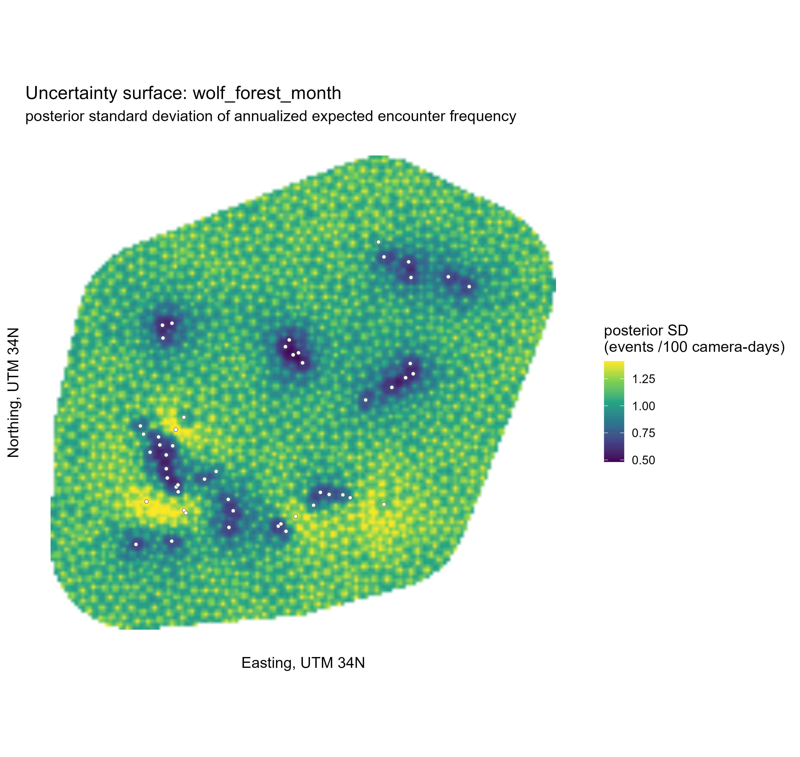
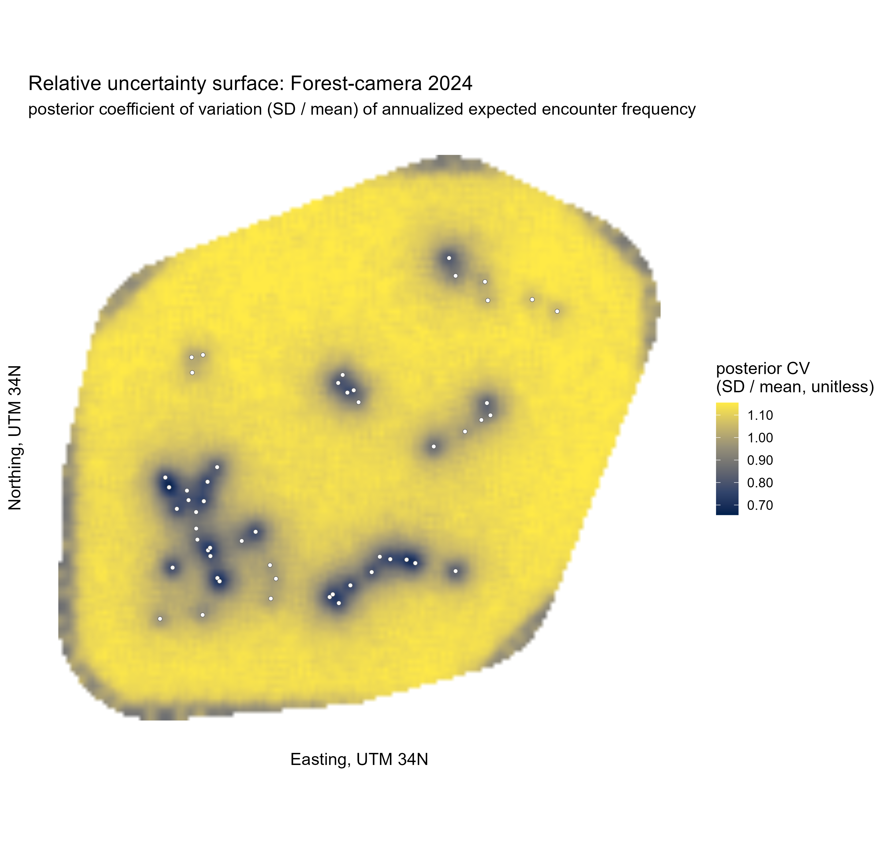
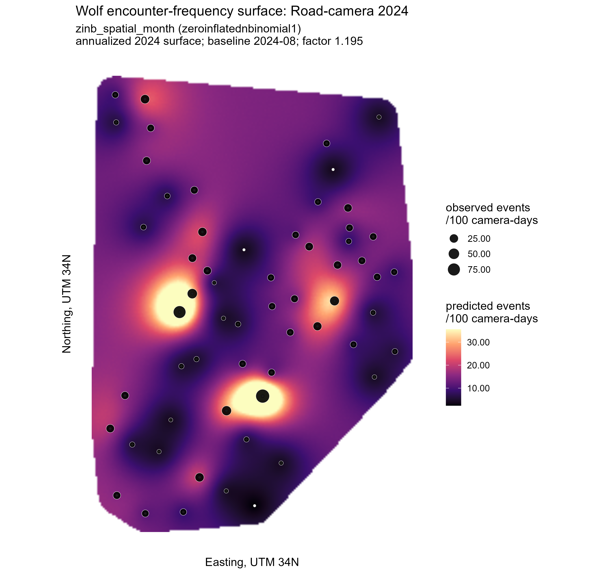
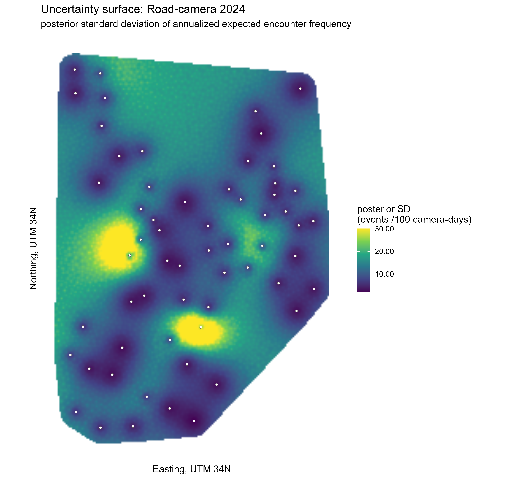
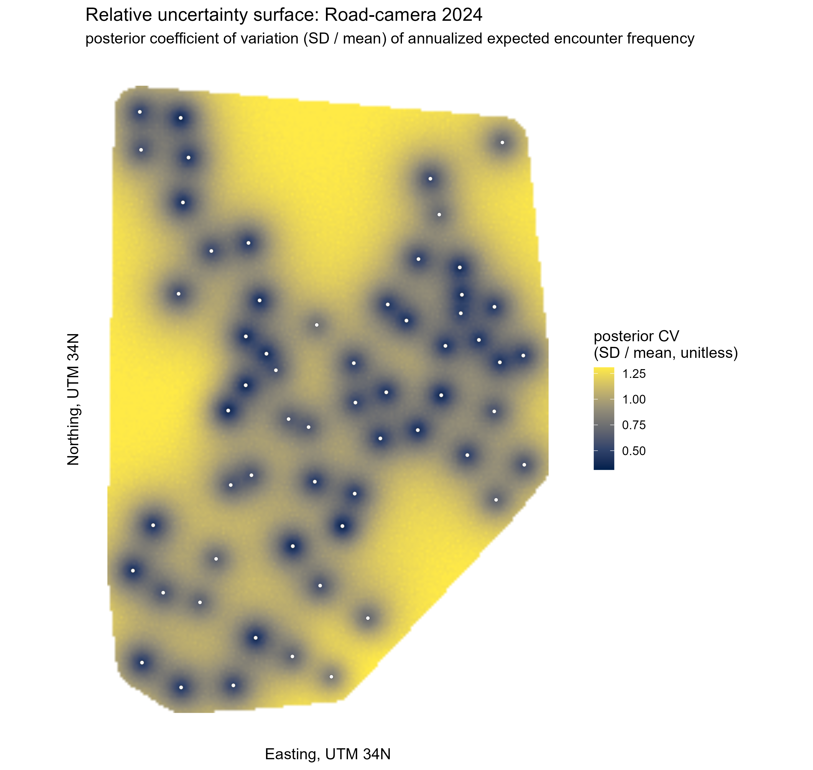

# Bayesian Spatial Encounter-Surface Models For 2023-2024 Wolf Camera-Trap Detections

This project contains the final 2023-2024 wolf relative encounter-frequency models
from camera-trap data. This file is the single reference for the ecological
question, the methodology, the input data structure, the three final wolf models
(plus two human-activity companion surfaces) with their full diagnostic numbers,
and the outputs needed to reproduce or audit the analysis. Each `results/` subfolder has its own short README that only
lists and describes the files it contains; all explanation lives here.

The analyses model the number of independent wolf event IDs recorded in
camera-month rows. The statistical approach is Bayesian count modelling with
INLA-SPDE spatial random fields. Active camera-days are used as an exposure
term, calendar month is included as a fixed temporal control, and outputs are
relative encounter-frequency surfaces expressed as expected wolf events per 100
camera-days across the sampled survey-year period. The maps should not be
interpreted as abundance, density, occupancy, or population size.

The study's primary target is the wolf. As a companion, the same pipeline is
also run for a human-activity index (people and vehicles) on the two road-camera
surveys, giving a relative human-disturbance surface; see
[Human-Activity Companion Surfaces](#human-activity-companion-surfaces) below.

All numbers below are from `WOLF_RUN_PROFILE=final` runs against the private
camera-trap data, and match the files committed under `results/`.

> **Refactor note (shared-library consolidation).** The three surveys now share
> one analysis library, `scripts/wolf_encounter_surface_lib.R`, run through thin
> per-survey runners (`run_road_2023.R`, `run_road_2024.R`, `run_forest_2024.R`),
> so every survey runs the identical analyses, diagnostics, and outputs. The
> road-camera 2023 and 2024 pipelines are behaviour-preserving (the library
> holds the same code that produced their committed results). The forest-camera
> 2024 survey now runs that same pipeline, which **added the candidate-likelihood
> model-comparison table it previously lacked** and standardized its
> prior-sensitivity set to the shared six variants. `results/forest_2024/` and
> the forest numbers in this document have been regenerated from a
> `WOLF_RUN_PROFILE=final` run of the unified pipeline; the mapping-fit
> hyperparameters and month effects are unchanged from before, while the
> diagnostic-refit figures (dispersion, PIT, temporal correlation) reflect the
> shared road-style diagnostic pipeline. See
> [Reproduction And Validation](#reproduction-and-validation) below.

## Final Models

Three wolf analyses are included, plus two human-activity companion surfaces
(people and vehicles on the road cameras; see
[Human-Activity Companion Surfaces](#human-activity-companion-surfaces)):

| Survey | Final model | Cameras | Events | Effort | Final output |
| --- | --- | ---: | ---: | ---: | --- |
| Road-camera 2023 | Negative-binomial spatial-month INLA-SPDE model | 60 | 586 | 5222.2 camera-days | `results/road_2023/` |
| Forest-camera 2024 | Negative-binomial spatial-month INLA-SPDE model | 53 | 46 | 4423.0 camera-days | `results/forest_2024/` |
| Road-camera 2024 | Zero-inflated negative-binomial spatial-month INLA-SPDE model | 60 | 479 | 3574.0 camera-days | `results/road_2024/` |
| Human-activity 2023 *(companion)* | Negative-binomial spatial-month INLA-SPDE model | 60 | 8284 | 5222.2 camera-days | `results/human_2023/` |
| Human-activity 2024 *(companion)* | Negative-binomial spatial-month INLA-SPDE model | 60 | 6781 | 3574.0 camera-days | `results/human_2024/` |

Quick-glance diagnostic status (full numbers are in each survey's section below):

| Survey | Likelihood | Required diagnostics | Open caveat |
| --- | --- | --- | --- |
| Road-camera 2023 | Negative-binomial | Pass | None |
| Forest-camera 2024 | Negative-binomial | Pass | Only 46 independent events, so posterior uncertainty on month/spatial effects is wide |
| Road-camera 2024 | Zero-inflated negative-binomial | Pass | Residual temporal autocorrelation of unestablished cause (mechanism tested and ruled out); cross-validation and mesh sensitivity indicate it does not distort the mapped surface |
| Human-activity 2023 *(companion)* | Negative-binomial | Pass | None |
| Human-activity 2024 *(companion)* | Negative-binomial | Fail | Small but significant residual spatial autocorrelation (Moran p = 0.020) not removed by finer meshing; retained as a relative disturbance index with that caveat |

For every survey, WAIC-based model comparison clearly rejects a simpler
Poisson likelihood in favor of the NB or ZINB model shown above. For
road-camera 2023 specifically, a ZINB variant scored a fractionally lower
(better) WAIC than NB (delta WAIC 0.25), but its estimated zero-inflation
probability was small (3.2%) and not mechanistically justified, so the
simpler NB model was kept. See each survey's section below for the
comparison tables.

## Result Maps

Each survey below is mapped as three matching GeoTIFF/PNG surfaces, all
effort-weighted and annualized over that survey's sampled months (see
[Annualized Map Surface](#annualized-map-surface) below) -- not abundance,
density, occupancy, or population size.

All three are derived at every prediction-grid cell from the same posterior
linear predictor `eta(s) ~ N(eta_mean(s), eta_sd(s)^2)` that INLA returns for
that cell:

```text
mean(s) = annual_factor * 100 * exp(eta_mean(s) + 0.5 * eta_sd(s)^2)
cv(s)   = sqrt(exp(eta_sd(s)^2) - 1)
sd(s)   = mean(s) * cv(s)
```

This is the standard log-normal mean/SD/CV correction applied to the
annualized rate; `eta_sd(s)` is INLA's posterior SD of the linear predictor
at that cell, on the log scale.

- **Posterior mean** -- the central estimate itself, in independent wolf
  events per 100 camera-days.
- **Posterior SD** -- absolute uncertainty, on the same units as the mean.
  Because `sd(s) = mean(s) * cv(s)`, it is a product of the local rate's
  magnitude and its relative uncertainty: a cell with a low predicted rate
  has a low absolute SD even where its relative uncertainty is high.
- **Posterior CV** (`sd(s) / mean(s)`) -- relative uncertainty, unitless,
  not confounded by the local rate's magnitude. This is the map to check
  for "how much do we actually know here": whether a cell's estimate is
  mostly driven by nearby camera data or has fallen back toward the
  model's fixed-effect baseline.

**Display note.** The PNG figures are prepared for legibility at print
resolution: a light 3x3 focal-mean smoothing is applied and the color scale
is capped at each surface's 98th percentile, so a handful of extreme cells
do not dominate the palette. These are display-only steps. The GeoTIFF
raster in each results folder holds the raw, unsmoothed, uncapped model
output and is the file to use for any quantitative or GIS work.

The same mechanism governs both the mean map's behavior between cameras and
the SD/CV maps' uncertainty: the spatial random field `u(s)` is a
stationary Gaussian field with an estimated **range**, the distance over
which nearby cameras' data pull it away from zero. Within roughly one
range-length of a camera, `u(s)` is informed by that camera's data and the
mean estimate can sit meaningfully above or below the population baseline.
Beyond that distance, `u(s)` reverts toward its prior mean of zero, so the
mean estimate reverts toward the fixed-effect baseline (intercept plus
month effect) -- not because the model "gives up" at an arbitrary radius,
but because there is no data left nearby to inform it. The same reversion
shows up as rising, then saturating, SD and CV: once `eta_sd(s)` reaches
the field's marginal (prior) variance, both are at their local ceiling.

This range is an estimated hyperparameter, not a fixed radius we chose, and
it differs by survey:

| Survey | Spatial range posterior mean | 95% credible interval |
| --- | ---: | ---: |
| Road-camera 2023 | 2965 m | 1337 to 5394 m |
| Road-camera 2024 | 4175 m | 2007 to 7618 m |
| Forest-camera 2024 | 584 m | 150 to 1599 m |

Forest-camera 2024's range is roughly 5-7x shorter than the two road
surveys', so its mean map falls back to baseline much closer to each
camera, and its CV map saturates to its ceiling almost everywhere outside
the immediate camera clusters (see that survey's map above). The range
itself is also fairly uncertain in all three surveys -- forest's 95%
interval spans 150 to 1599 m -- which is a direct consequence of having
comparatively few independent wolf events to estimate it from.

### Road-Camera 2023

| Posterior mean | Posterior SD | Posterior CV |
| --- | --- | --- |
|  |  |  |

### Forest-Camera 2024

| Posterior mean | Posterior SD | Posterior CV |
| --- | --- | --- |
|  |  |  |

### Road-Camera 2024

| Posterior mean | Posterior SD | Posterior CV |
| --- | --- | --- |
|  |  |  |

## Common Modelling Target

The response is an independent wolf event count per camera-month row. The
exposure is camera effort in camera-days, passed to INLA through the `E`
argument, so the linear predictor describes the expected daily encounter
rate and map outputs are converted to expected events per 100 camera-days.

The models estimate relative encounter frequency, not abundance, density,
occupancy, or population size. Camera-trap encounter rates are a standard
relative-abundance index in ecology when detection probability cannot be
estimated directly (Rowcliffe et al. 2008; O'Brien 2011).

For camera-month row `i`, the shared model structure is:

```text
log(mu_i) = log(E_i) + beta_0 + gamma[m_i] + u(s_i)
```

where `mu_i` is the expected event count, `E_i` is active camera-days,
`beta_0` is the model intercept on the log encounter-rate scale, `gamma[m_i]`
is the fixed effect for calendar month, and `u(s_i)` is a spatial random
field estimated with the INLA-SPDE method: the field is represented on a
triangulated mesh over the study area and given a Matérn covariance via a
stochastic partial differential equation, fitted by integrated nested
Laplace approximation rather than MCMC (Rue, Martino & Chopin 2009; Lindgren,
Rue & Lindström 2011). Two of the three models use a negative-binomial
likelihood for `y_i` to absorb overdispersion beyond what a Poisson count
model allows (Hilbe 2011); the road-camera 2024 model additionally uses a
zero-inflated negative-binomial likelihood (see that survey's section below).

## Data Units: Camera-Month Rows

All final models are fit on camera-month rows, not raw per-day or
per-deployment records:

1. A camera deployment is split at every calendar-month boundary it crosses.
2. Each resulting row's exposure is the number of active camera-days inside
   that specific camera-month interval.
3. Wolf events are assigned to the row whose month contains the event's
   `eventStart` timestamp.

For example, a camera deployed 2023-07-20 to 2023-08-15 produces two rows:
one for July (12 active days, 2023-07-20 to 2023-07-31) and one for August
(15 active days, 2023-08-01 to 2023-08-15). Any wolf event recorded in that
window is assigned to whichever row's month contains it. This keeps effort
and events aligned and avoids mixing two different months' exposure into one
row.

The calendar month itself enters the model as a fixed effect (`gamma[m_i]`
above), estimated jointly with the spatial field, not fit separately.

## Annualized Map Surface

Month is a fixed effect in the model, but the published maps are not a
single-month prediction. Each survey's sampled months are combined into one
effort-weighted, annualized surface:

```text
lambda_year(s) = sum_m w_m * 100 * exp(beta_0 + gamma[m] + u(s))
```

`w_m` is the share of that survey's total camera-days that fell in month
`m`. Equivalently, the reference-month prediction is scaled by an
annualization factor: the effort-weighted average of `exp(gamma[m] -
gamma[m_ref])` over all sampled months. Concretely, for road-camera 2023
(reference month 2023-08):

| Month | Share of camera-days | Rate ratio vs. 2023-08 |
| --- | ---: | ---: |
| 2023-07 | 0.296 | 0.969 |
| 2023-08 (reference) | 0.341 | 1.000 |
| 2023-09 | 0.334 | 1.371 |
| 2023-10 | 0.030 | 1.078 |

The effort-weighted average of the rate-ratio column is 1.117 -- the
annualization factor reported for that survey below. It means the
sampled-year average rate runs about 11.7% above the August-only rate,
mostly because September (33% of camera-days) has a higher fitted rate. Each
survey's full weight table is in
`results/<survey>/wolf_<survey>_annualization_weights.csv`.

## Diagnostic Gate

A model is called final only if it clears a specific gate: the camera-level
posterior predictive checks (total events, zero fraction, max count; Gelman,
Meng & Stern 1996) and the residual Moran's I spatial-autocorrelation test
(a two-sided permutation test, scaled by `WOLF_RUN_PROFILE`, applied to model
residuals following Dormann et al. 2007; Moran 1950). All three surveys run
this identical gate from the shared analysis library.

PIT (probability integral transform) KS p-values (Czado, Gneiting & Held
2009, for discrete/count outcomes) are also computed and reported for every
model as a supporting calibration diagnostic, but are not part of the gate.
Camera-level PIT is sensitive to small-count discreteness and camera-level
clustering in ways that do not track whether the mapped spatial surface
itself is distorted, so a low PIT KS p-value is reported but does not on its
own fail a model. For example, the road-camera 2023 model reports "required
diagnostics pass: TRUE" alongside a camera PIT KS p-value near 0.0015: the
low value is shown, not dropped, but does not gate the pass/fail call.

Model comparison across candidate likelihoods (Poisson / NB / ZINB) uses
WAIC (Watanabe 2010), cross-checked against DIC (Spiegelhalter et al. 2002).
Out-of-sample predictive performance is checked with spatial block
cross-validation: cameras are grouped into spatial folds by k-means
clustering, each fold is held out in turn, and the SPDE mesh for that fold
is rebuilt from the training cameras only, so no held-out location leaks
into the training mesh (following the general spatially-blocked
cross-validation approach of Roberts et al. 2017). Held-out counts are
simulated from full joint posterior draws of the fitted model.

For all three surveys, this posterior-predictive step refits a separate
diagnostic model to draw the joint posterior samples. The hyperparameter
summaries printed in each survey's `validation_report.txt` come from that
refit and can differ marginally from the mapping-fit values (for example,
road-camera 2024 negative-binomial size 3.62 in the refit vs. 3.30 in the
mapping fit). The values reported in this document, and in each survey's
`hyperparameters.csv`, are the mapping-fit values -- the fit that actually
produces the published surfaces.

**Sensitivity checks.** For every survey, the shared library refits the final
model under perturbed priors (six variants) and perturbed SPDE mesh resolution
(finer/coarser) and reports whether WAIC, DIC, and posterior hyperparameters
stay stable. Because all surveys run the same code, these checks are identical
in scope across surveys: they test WAIC/DIC/hyperparameter stability rather
than recomputing the full PPC/Moran's I gate at each variant.

**Are the priors really weakly informative?** Yes, for all three models, on
two grounds. By construction, every prior is deliberately wide: the
intercept and NB-size priors use SD 2.5 and 2 on the log scale, the month
log-rate-ratio priors use SD 1, and the spatial range/SD priors are PC
priors (Fuglstad et al. 2019; Simpson et al. 2017), a family specifically
designed to shrink toward simplicity without dominating the likelihood.
Empirically, each model's prior-sensitivity check (six variants per survey,
see each survey's section below) shows WAIC and the posterior
hyperparameters stay essentially stable as the priors are perturbed --
that stability is the evidence that the data, not the prior, is driving the
posterior. The one caveat is forest-camera 2024: with only 46 events, the
*relative* influence of the prior on the posterior is higher simply because
there is so little likelihood information to compete with it -- a
data-sparsity effect, not the prior itself being more informative than
described.

## Repository Layout

```text
CameraSpatialEncounterSurfaces2023_2024/
  README.md
  data/
    README.md
  results/
    README.md
    road_2023/
    forest_2024/
    road_2024/
    human_2023/                    # companion: human-activity surface
    human_2024/                    # companion: human-activity surface
  scripts/
    wolf_encounter_surface_lib.R   # shared analysis library: all workflow logic
    run_road_2023.R                # runner: road-camera 2023 (negative-binomial)
    run_road_2024.R                # runner: road-camera 2024 (zero-inflated NB)
    run_forest_2024.R              # runner: forest-camera 2024 (negative-binomial)
    run_road_2023_human.R          # runner: 2023 human-activity companion surface
    run_road_2024_human.R          # runner: 2024 human-activity companion surface
    capture_session_info.R         # records R/INLA versions for reproducibility
```

All three surveys run the **same** analyses, diagnostics, and outputs, because
they share one analysis library (`wolf_encounter_surface_lib.R`). Each `run_*.R`
runner is a thin entry point that only sets its survey's likelihood family,
priors, mesh settings, and data paths, then sources the library. Surveys differ
only in that configuration and in the shape of their raw input data (the two
road surveys read separate deployment/observation tables; the forest survey
reads a single dated flat file), never in the analysis code itself. The same
library also produces the two human-activity companion surfaces (see
[Human-Activity Companion Surfaces](#human-activity-companion-surfaces) below),
by overriding only the detection labels.

Raw camera-trap CSV files are not committed here. The `data/README.md` file
lists the expected input files and where to place them for reproduction.
Each `results/<survey>/` folder has its own README listing exactly what each
committed file contains; this file is where all explanation of methodology
and numbers lives.

## Main Scripts

Each survey is run through its thin runner, which sources the shared
`wolf_encounter_surface_lib.R` and runs the identical ordered workflow.

### Road-Camera 2023 Final Model

```sh
Rscript scripts/run_road_2023.R
```

Final model: negative-binomial likelihood, INLA-SPDE spatial component,
calendar-month fixed effects, active camera-days as exposure, effort-weighted
annualized 2023 map target. Full priors and diagnostics are in
[Road-Camera 2023 Model](#road-camera-2023-model) below.

### Forest-Camera 2024 Final Model

```sh
Rscript scripts/run_forest_2024.R
```

Final model: negative-binomial likelihood, INLA-SPDE spatial component,
calendar-month fixed effects, active camera-days as exposure, effort-weighted
annualized 2024 map target. Full priors and diagnostics are in
[Forest-Camera 2024 Model](#forest-camera-2024-model) below.

### Road-Camera 2024 Final Model

```sh
Rscript scripts/run_road_2024.R
```

Final model: zero-inflated negative-binomial (type 1) likelihood, INLA-SPDE
spatial component, calendar-month fixed effects, active camera-days as
exposure, effort-weighted annualized 2024 map target. Full priors and
diagnostics are in [Road-Camera 2024 Model](#road-camera-2024-model) below.

## Runtime Profiles

All workflows use the `WOLF_RUN_PROFILE` environment variable:

```sh
# Fast development run
WOLF_RUN_PROFILE=quick

# Recommended reproducible analysis
WOLF_RUN_PROFILE=balanced

# Heavier final run with more posterior simulations
WOLF_RUN_PROFILE=final
```

On Windows PowerShell, for example:

```powershell
$env:WOLF_RUN_PROFILE = "balanced"
& "C:\Program Files\R\R-4.5.2\bin\Rscript.exe" scripts\run_road_2024.R
```

Path overrides are available:

```powershell
$env:WOLF_PROJECT_DIR = "C:\path\to\CameraSpatialEncounterSurfaces2023_2024"
$env:WOLF_DATA_DIR = "C:\path\to\CameraSpatialEncounterSurfaces2023_2024\data"
$env:WOLF_OUTPUT_DIR = "C:\path\to\outputs"
```

## Road-Camera 2023 Model

Final script:

```text
scripts/run_road_2023.R
```

Final output folder:

```text
results/road_2023/
```

Model:

```text
y_i ~ NegativeBinomial(mu_i, size)
log(mu_i) = log(effort_i) + intercept + month_i + spatial(s_i)
```

Key settings:

- 490 camera-month rows;
- 60 cameras;
- 586 independent wolf events;
- 5222.2 camera-days;
- observed mean encounter frequency: 11.221 events per 100 camera-days;
- map target: effort-weighted annualized 2023 surface (annualization factor
  1.117, see [Annualized Map Surface](#annualized-map-surface) above).

Weakly informative priors:

- intercept: Gaussian(mean = -2.187, SD 2.5 on log scale), centered on the
  crude observed daily rate;
- month log-rate ratios: Gaussian(0, SD 1);
- negative-binomial log(size): Gaussian(log(2), SD 2);
- spatial range: PC prior, `P(range < 5000 m) = 0.5` (Fuglstad et al. 2019);
- spatial marginal SD: PC prior, `P(SD > 2.0) = 0.05` (Simpson et al. 2017).

Fitted hyperparameters (from the mapping fit,
`results/road_2023/wolf_2023_hyperparameters.csv`):

- negative-binomial size posterior mean: 1.733;
- spatial range posterior mean: 2965 m (95% CrI 1337 to 5394 m);
- spatial SD posterior mean: 1.184 (95% CrI 0.890 to 1.541).

Model comparison:

| Model | WAIC | Delta WAIC |
| --- | ---: | ---: |
| ZINB spatial-month | 1162.65 | 0.00 |
| NB spatial-month | 1162.90 | 0.25 |
| Poisson spatial-month | 1303.06 | 140.41 |

ZINB is only marginally lower by WAIC and has a low estimated zero-inflation
probability (mean 0.032), so the negative-binomial spatial-month model is
retained for parsimony.

Main diagnostics:

- posterior predictive camera total events / zero fraction / maximum count:
  all pass;
- row Pearson dispersion: 0.662; camera Pearson dispersion: 0.283;
- residual Moran's I: -0.003 (expected -0.017), two-sided p = 0.472;
- row PIT KS p-value: 0.05411; camera PIT KS p-value: 0.001204
  (supporting diagnostic, not part of the gate -- see
  [Diagnostic Gate](#diagnostic-gate) above);
- required diagnostics pass: TRUE;
- temporal residual autocorrelation: within-camera lag-1 r = 0.015,
  p = 0.7641 (n = 430 pairs); no evidence of residual temporal
  autocorrelation; date-ordered mean-residual lag-1 ACF: -0.177;
- spatial block cross-validation: row 90 percent coverage = 0.96, camera 90
  percent coverage = 0.93;
- prior sensitivity: WAIC, DIC, and posterior hyperparameters (NB size,
  spatial range, spatial SD) are stable across 6 prior variants (WAIC 1162.80
  to 1163.56; delta WAIC 0.00 to 0.76; stability checked, gate not
  recomputed per variant -- see "Sensitivity checks" above);
- mesh sensitivity: WAIC and hyperparameters are stable across the final,
  finer, and coarser mesh variants (WAIC 1162.81 to 1163.05; delta WAIC 0.00
  to 0.24; same basis as above).

Exploratory check: a Spearman correlation of deployment start day-of-year
against UTM northing (`results/road_2023/wolf_2023_exploratory_timing_vs_northing.csv`)
gives rho = 0.042, p = 0.357 (n = 490) -- deployment timing is not
meaningfully correlated with camera location in this survey.

## Forest-Camera 2024 Model

Final script:

```text
scripts/run_forest_2024.R
```

Final output folder:

```text
results/forest_2024/
```

Model:

```text
y_i ~ NegativeBinomial(mu_i, size)
log(mu_i) = log(effort_i) + intercept + month_i + spatial(s_i)
```

Key settings:

- 356 camera-month rows;
- 53 cameras;
- 46 independent wolf events;
- 4423.0 camera-days;
- observed mean encounter frequency: 1.040 events per 100 camera-days;
- map target: effort-weighted annualized 2024 surface (annualization factor
  1.035).

Weakly informative priors:

- intercept: Gaussian(mean = -4.566, SD 2.5 on log scale), centered on the
  crude observed daily rate;
- month log-rate ratios: Gaussian(0, SD 1);
- negative-binomial log(size): Gaussian(log(2), SD 2);
- spatial range: PC prior, `P(range < 1000 m) = 0.5`;
- spatial marginal SD: PC prior, `P(SD > 1.5) = 0.05`.

Fitted hyperparameters:

- negative-binomial size posterior mean: 1.836;
- spatial range posterior mean: 584.1 m (95% CrI 150.1 to 1598.9 m);
- spatial SD posterior mean: 0.816 (95% CrI 0.389 to 1.454).

Month effects (rate ratio vs. reference month 2024-08):

- 2024-03: 0.34 (95% CrI 0.08 to 1.47);
- 2024-04: 0.65 (95% CrI 0.22 to 1.92);
- 2024-05: 0.91 (95% CrI 0.36 to 2.31);
- 2024-06: 1.69 (95% CrI 0.74 to 3.79);
- 2024-07: 1.28 (95% CrI 0.53 to 3.07);
- 2024-09: 0.67 (95% CrI 0.23 to 1.99).

Model comparison:

| Model | WAIC | Delta WAIC |
| --- | ---: | ---: |
| NB spatial-month | 270.22 | 0.00 |
| ZINB spatial-month | 270.51 | 0.29 |
| Poisson spatial-month | 274.02 | 3.81 |

The negative-binomial model has the best (lowest) WAIC. A ZINB variant is only
marginally behind (delta WAIC 0.29) with a small estimated zero-inflation
probability (mean 0.093), and Poisson is clearly rejected (delta WAIC 3.81), so
the negative-binomial spatial-month model is retained.

Main diagnostics:

- posterior predictive row and camera total events / zero fraction /
  maximum count: all pass;
- row Pearson dispersion: 0.413; camera Pearson dispersion: 0.409;
- residual Moran's I: -0.036 (expected -0.019), two-sided p = 0.692;
- row PIT KS p-value: 0.4199; camera PIT KS p-value: 0.156;
- required diagnostics pass: TRUE;
- temporal residual autocorrelation: within-camera lag-1 r = -0.000,
  p = 0.9963 (n = 303 pairs); date-ordered mean-residual lag-1 ACF: -0.013;
  no evidence of residual temporal autocorrelation;
- spatial block cross-validation: row 90 percent coverage = 0.98, camera 90
  percent coverage = 0.92. Each fold's SPDE mesh is rebuilt from the
  training-fold cameras only, and held-out counts are simulated from full
  joint posterior samples;
- prior sensitivity: WAIC, DIC, and posterior hyperparameters stay stable
  across the shared six prior variants (WAIC 269.54 to 277.26);
- mesh sensitivity: final, finer, and coarser mesh variants; WAIC range =
  269.49 to 270.21.

Main limitation: the forest-camera dataset contains only 46 independent wolf
events. Weakly informative priors do not add information the data lack, so
with this few events the posterior for month and spatial effects stays wide
-- the wide credible intervals above reflect data sparsity, not the priors
being informative. The model remains valid for relative encounter-frequency
mapping, but month and spatial effects should be read with that wide
uncertainty in mind.

## Road-Camera 2024 Model

Final script:

```text
scripts/run_road_2024.R
```

Final output folder:

```text
results/road_2024/
```

Model:

```text
y_i ~ ZeroInflatedNegativeBinomial1(mu_i, size, pi)
log(mu_i) = log(effort_i) + intercept + month_i + spatial(s_i)
```

`ZeroInflatedNegativeBinomial1` is INLA's type-1 zero-inflated
negative-binomial parameterization (see Martin et al. 2005 for the ecological
rationale for modelling structural zeros separately from count-process
zeros). `pi` is the additional structural-zero probability, while `mu_i` and
`size` describe the negative-binomial count component.

Key settings:

- 344 camera-month rows;
- 60 cameras;
- 479 independent wolf events;
- 3574.0 camera-days;
- observed mean encounter frequency: 13.402 events per 100 camera-days;
- map target: effort-weighted annualized 2024 surface (annualization factor
  1.195).

Weakly informative priors:

- intercept: Gaussian(mean = -2.010, SD 2.5 on log scale), centered on the
  crude observed daily rate;
- month log-rate ratios: Gaussian(0, SD 1);
- zero-inflation logit probability: Gaussian(mean = -2.94, SD approximately
  1.5 on logit scale);
- negative-binomial log(size): Gaussian(log(2), SD 2);
- spatial range: PC prior, `P(range < 5000 m) = 0.5`;
- spatial marginal SD: PC prior, `P(SD > 2.5) = 0.05`.

Fitted hyperparameters (from the mapping fit,
`results/road_2024/wolf_2024_hyperparameters.csv`):

- zero-inflation probability posterior mean: 0.063;
- negative-binomial size posterior mean: 3.297;
- spatial range posterior mean: 4175 m (95% CrI 2007 to 7618 m);
- spatial SD posterior mean: 0.961 (95% CrI 0.703 to 1.281).

Model comparison:

| Model | WAIC | Delta WAIC |
| --- | ---: | ---: |
| ZINB spatial-month | 933.64 | 0.00 |
| NB spatial-month | 937.32 | 3.68 |
| Poisson spatial-month | 997.30 | 63.66 |

Main diagnostics:

- posterior predictive camera total events / zero fraction / maximum count:
  all pass;
- row Pearson dispersion: 0.591; camera Pearson dispersion: 0.236;
- residual Moran's I: -0.035 (expected -0.017), two-sided p = 0.343;
- row PIT KS p-value: 0.07704; camera PIT KS p-value: 0.0003356;
- required diagnostics pass: TRUE;
- temporal residual autocorrelation: within-camera lag-1 r = -0.177,
  p = 0.002731 (n = 284 pairs); date-ordered mean-residual lag-1 ACF: 0.252.
  Residual deployment-order temporal structure remains detectable here,
  unlike the other two surveys. The originally hypothesized mechanism
  (staggered deployment timing correlated with camera location) was tested
  directly: a Spearman correlation of deployment start day-of-year against
  UTM northing (`results/road_2024/wolf_2024_exploratory_timing_vs_northing.csv`)
  gives rho = 0.058, p = 0.280 (n = 344) -- not a meaningful correlation, so
  it does not explain the residual autocorrelation, and no specific
  mechanism is established. This is treated as an open temporal caution
  rather than corrected, on the grounds that it does not appear to distort
  the mapped spatial surface: the spatial field is fit jointly with, and net
  of, the month effect, and both spatial block cross-validation coverage and
  mesh sensitivity remain stable (below);
- spatial block cross-validation: row 90 percent coverage = 0.97, camera 90
  percent coverage = 0.93;
- prior sensitivity: WAIC, DIC, and posterior hyperparameters are stable
  across the retained prior variants (WAIC 933.40 to 933.89; delta WAIC 0.00
  to 0.50; stability checked, gate not recomputed per variant -- see
  "Sensitivity checks" above);
- mesh sensitivity: WAIC and hyperparameters are stable across the final,
  finer, and coarser mesh variants (WAIC 933.32 to 933.64; delta WAIC 0.00
  to 0.32; same basis as above).

## Final Interpretation

All three models are final for relative encounter-frequency mapping and pass
the required diagnostic gate (camera-level PPC plus residual Moran's I).

The road-camera 2023 model shows no evidence of residual temporal
autocorrelation and is retained as a parsimonious NB model over the
marginally-better-fitting ZINB alternative. The forest-camera 2024 model's
prior and mesh sensitivity variants independently re-verify the same
diagnostic gate at every variant, the most thorough check of the three; its
main limitation is the small number of independent events (46), which widens
posterior uncertainty on month and spatial effects without indicating a
model problem. The road-camera 2024 model passes the required
posterior-predictive and spatial diagnostics and is supported over NB/Poisson
by WAIC; its one open issue is a residual within-camera temporal correlation
whose mechanism is not established, but which spatial block cross-validation
and mesh sensitivity both indicate does not distort the mapped spatial
surface.

## Human-Activity Companion Surfaces

Because the camera detections file also records people and vehicles, the
identical pipeline was run for a **human-activity index** on the two road-camera
surveys, as a companion to the wolf maps (a relative human-disturbance surface,
not the study's primary target). "Human activity" is the count of independent
events labelled *Homo sapiens*, `cars`, `bikes`, or `motorcycle`. Only the
detection labels, output prefix, mesh resolution, and a slightly re-centred
spatial-range prior differ from the wolf road runners; the model, diagnostics,
and outputs are otherwise the same.

```sh
Rscript scripts/run_road_2023_human.R
Rscript scripts/run_road_2024_human.R
```

Final outputs are in `results/human_2023/` and `results/human_2024/` (the same
file set as the wolf surveys, with the `human_2023_` / `human_2024_` prefix).

| Survey | Cameras | Events | Effort | Observed rate /100 | Final model | Required diagnostics |
| --- | ---: | ---: | --- | ---: | --- | --- |
| Human-activity 2023 | 60 | 8284 | 5222.2 camera-days | 158.6 | NB spatial-month | Pass |
| Human-activity 2024 | 60 | 6781 | 3574.0 camera-days | 189.7 | NB spatial-month | Fail (residual Moran; see caveat) |

Model comparison strongly prefers the negative-binomial likelihood for both
years (2023: NB best, ZINB delta WAIC 2.80, Poisson 372.6; 2024: NB best, ZINB
2.93, Poisson 806.2 -- Poisson is decisively rejected by the large counts).

Fitted hyperparameters:

- 2023: negative-binomial size 12.64; spatial range 1349 m (95% CrI 123 to
  4620 m); spatial SD 1.16.
- 2024: negative-binomial size 6.51; spatial range 1204 m (95% CrI 328 to
  2643 m); spatial SD 1.06.

Human activity is far less overdispersed than wolves (NB size ~6-13 vs ~1.7-1.8)
and varies on a shorter spatial scale (range ~1.2-1.3 km vs ~3-4 km) -- as
expected for activity tied to roads and settlements.

Diagnostics:

- 2023: row Pearson dispersion 0.914; residual Moran's I -0.010 (two-sided
  p = 0.692); spatial block CV row/camera 90% coverage 0.86 / 0.82; required
  diagnostics pass: TRUE.
- 2024: row Pearson dispersion 0.646; residual Moran's I 0.029 (two-sided
  p = 0.020); spatial block CV row/camera 90% coverage 0.88 / 0.75; required
  diagnostics pass: FALSE.

**Mesh and priors.** The human mesh is finer than the road-wolf mesh (inner
edge 300 m, below range/5) because human activity has a shorter spatial range;
the mesh-sensitivity check confirms the fit is insensitive to further
refinement. The priors are weakly informative -- verified by the
prior-sensitivity check, where WAIC and the posterior hyperparameters barely
move across perturbations.

**Caveat (human-activity 2024).** This survey shows a small but statistically
significant residual spatial autocorrelation (Moran's I 0.029, p = 0.020) that a
finer mesh does not remove -- genuine fine-scale human structure (roads,
settlements) that a smooth stationary field cannot fully absorb. The surface is
retained as a relative human-activity index with this caveat (analogous to the
road-camera 2024 wolf model's residual temporal-autocorrelation caveat); it
should not be read as a fully clean fit.

## Outputs Included Here

Across the final-results folders, the curated outputs include:

- final validation report;
- posterior predictive checks;
- hyperparameter summaries;
- month-effect summaries;
- prior sensitivity reports and tables;
- mesh sensitivity reports and tables for all three analyses;
- model-comparison report and table for every survey (the forest-camera table
  is added by the unified pipeline; see the refactor note near the top);
- spatial block cross-validation summaries;
- temporal residual diagnostics;
- posterior mean encounter-frequency map as PNG and GeoTIFF;
- posterior-SD (absolute uncertainty) map as PNG and GeoTIFF;
- posterior-CV (relative uncertainty) map as PNG and GeoTIFF.

The full generated output folders also contain exploratory plots, full
prediction grids, and additional intermediate diagnostics. Those full scratch
archives are not part of the curated GitHub result set. Each `results/<survey>/`
folder's own README lists exactly which files are included and what each one
contains.

## Required R Packages

- `readr`
- `dplyr`
- `tidyr`
- `sf`
- `terra`
- `ggplot2`
- `viridis`
- `scales`
- `INLA`

The scripts do not install packages automatically unless explicitly changed by
the user. INLA usually requires installing from the INLA repository.

## Reproduction And Validation

Every survey is produced by one command that sources the shared library:

```sh
Rscript scripts/run_road_2023.R        # negative-binomial, road-camera 2023
Rscript scripts/run_road_2024.R        # zero-inflated negative-binomial, road 2024
Rscript scripts/run_forest_2024.R      # negative-binomial, forest-camera 2024
Rscript scripts/run_road_2023_human.R  # companion: 2023 human-activity surface
Rscript scripts/run_road_2024_human.R  # companion: 2024 human-activity surface
```

with `WOLF_RUN_PROFILE` set to `final` for a publication run (see
[Runtime Profiles](#runtime-profiles)). Each writes its full output archive to
`outputs/…`; the curated subset is what lives under `results/`. The raw
camera-trap data are private and will be released with the associated
publication; no sample data are distributed in this repository.

**Validation checklist after the shared-library consolidation.** Because the
raw survey data are private, the committed `results/` must be regenerated on the
machine that holds them, then checked:

1. Run all three runners with `WOLF_RUN_PROFILE=final`.
2. **Road-camera 2023 and 2024:** the refactor is behaviour-preserving, so the
   regenerated `hyperparameters.csv`, `model_comparison.csv`, `run_manifest.csv`,
   diagnostic reports, and map GeoTIFFs should match the committed
   `results/road_2023/` and `results/road_2024/` files (bit-for-bit, modulo
   INLA-version drift). Diff them to confirm.
3. **Forest-camera 2024:** the survey now runs the full road-style pipeline, so
   it produces additional files (`wolf_forest_2024_model_comparison.csv` /
   `_model_comparison_report.txt`, `_model_choice_report.txt`,
   `_science_checks_summary.txt`) and a road-style prior-sensitivity table.
   Re-curate `results/forest_2024/` from the new `outputs/…` archive and update
   the [Forest-Camera 2024 Model](#forest-camera-2024-model) diagnostic numbers
   and the model-comparison intro in this document to match.
4. Re-run `Rscript scripts/capture_session_info.R` and commit
   `results/session_info.txt`.

## Reproducibility

INLA results can shift across package versions and INLA builds, and this
repository does not pin one. To make a specific run reproducible:

- Run `Rscript scripts/capture_session_info.R` in the same R environment used
  for a final run and commit the resulting `results/session_info.txt`. It
  records `sessionInfo()` plus the exact INLA package version and build.
- For a fuller environment pin, initialize [`renv`](https://rstudio.github.io/renv/)
  in this project (`renv::init()`) and commit the generated `renv.lock`.

The raw camera-trap data are private and are not distributed here; they will be
released with the associated publication (see `data/README.md`).

## References

- Czado, C., Gneiting, T. & Held, L. (2009). Predictive model assessment for
  count data. *Biometrics*, 65(4), 1254-1261.
- Dormann, C. F. et al. (2007). Methods to account for spatial
  autocorrelation in the analysis of species distributional data: a review.
  *Ecography*, 30(5), 609-628.
- Fuglstad, G.-A., Simpson, D., Lindgren, F. & Rue, H. (2019). Constructing
  priors that penalize the complexity of Gaussian random fields. *Journal of
  the American Statistical Association*, 114(525), 445-452.
- Gelman, A., Meng, X.-L. & Stern, H. (1996). Posterior predictive assessment
  of model fitness via realized discrepancies. *Statistica Sinica*, 6(4),
  733-760.
- Hilbe, J. M. (2011). *Negative Binomial Regression* (2nd ed.). Cambridge
  University Press.
- Lindgren, F., Rue, H. & Lindström, J. (2011). An explicit link between
  Gaussian fields and Gaussian Markov random fields: the stochastic partial
  differential equation approach. *Journal of the Royal Statistical Society:
  Series B*, 73(4), 423-498.
- Martin, T. G. et al. (2005). Zero tolerance ecology: improving ecological
  inference by modelling the source of zero observations. *Ecology Letters*,
  8(11), 1235-1246.
- Moran, P. A. P. (1950). Notes on continuous stochastic phenomena.
  *Biometrika*, 37(1/2), 17-23.
- O'Brien, T. G. (2011). Abundance, density and relative abundance: a
  conceptual framework. In *Camera Traps in Animal Ecology* (pp. 71-96).
  Springer.
- Roberts, D. R. et al. (2017). Cross-validation strategies for data with
  temporal, spatial, hierarchical, or phylogenetic structure. *Ecography*,
  40(8), 913-929.
- Rowcliffe, J. M., Field, J., Turvey, S. T. & Carbone, C. (2008). Estimating
  animal density using camera traps without the need for individual
  recognition. *Journal of Applied Ecology*, 45(4), 1228-1236.
- Rue, H., Martino, S. & Chopin, N. (2009). Approximate Bayesian inference
  for latent Gaussian models by using integrated nested Laplace
  approximations. *Journal of the Royal Statistical Society: Series B*,
  71(2), 319-392.
- Simpson, D., Rue, H., Riebler, A., Sørbye, S. H. & Fuglstad, G.-A. (2017).
  Penalising model component complexity: a principled, practical approach to
  constructing priors. *Statistical Science*, 32(1), 1-28.
- Spiegelhalter, D. J., Best, N. G., Carlin, B. P. & van der Linde, A.
  (2002). Bayesian measures of model complexity and fit. *Journal of the
  Royal Statistical Society: Series B*, 64(4), 583-639.
- Watanabe, S. (2010). Asymptotic equivalence of Bayes cross validation and
  widely applicable information criterion in singular learning theory.
  *Journal of Machine Learning Research*, 11, 3571-3594.
